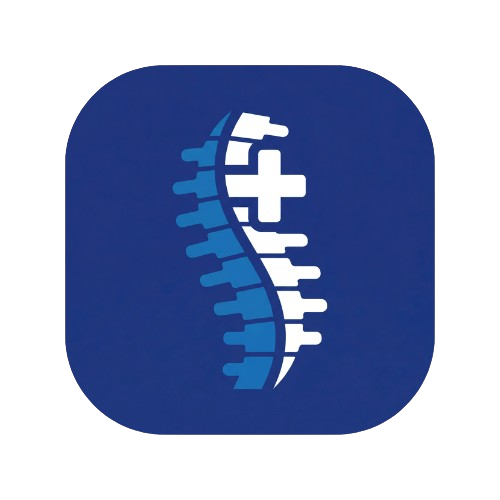
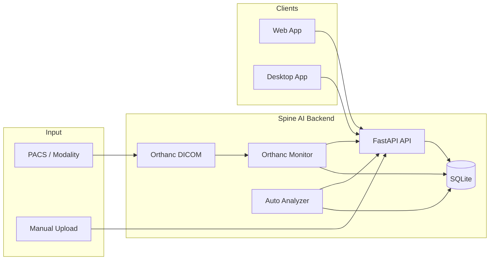
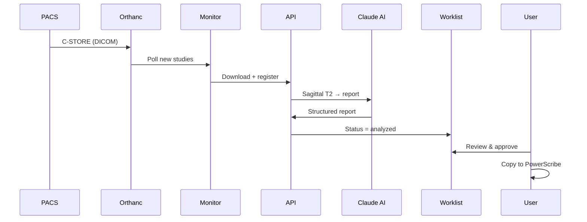
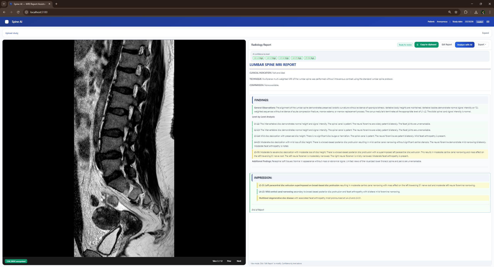
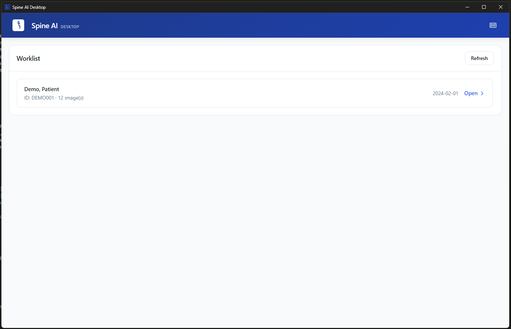

<p align="center">
  
</p>

<h1 align="center">Spine AI</h1>
<p align="center">
  <strong>AI-powered lumbar spine MRI analysis for radiology workflows</strong>
</p>

<p align="center">
  <a href="https://www.python.org/"></a>
  <a href="https://nodejs.org/"></a>
  <a href="https://react.dev/"></a>
  <a href="https://fastapi.tiangolo.com/"></a>
  <a href="https://www.electronjs.org/"></a>
  <a href="https://www.anthropic.com/"></a>
  <a href="LICENSE"></a>
</p>

<p align="center">
  Upload DICOM studies · View with a clinical-grade viewer · Generate structured reports with AI · Integrate with PACS and PowerScribe
</p>

---

## Use cases

- **Radiology groups** — Integrate AI draft reports into existing reading workflows and PACS.
- **Research & training** — Process lumbar spine cohorts with consistent, structured AI output.
- **PowerScribe users** — One-click copy of the AI report into your reporting system.
- **Deployment** — Run the backend on your network; use the web app or install the Windows desktop for worklist and clipboard.

---

## Overview

**Spine AI** is an end-to-end platform for lumbar spine MRI interpretation. It combines a standards-based DICOM pipeline with state-of-the-art AI (Anthropic Claude) to produce structured radiology reports, and fits into existing workflows via **web app**, **Windows desktop app**, **PACS (Orthanc)**, and **PowerScribe** clipboard integration.

| | |
|:---|:---|
| **DICOM in** | Manual upload or automatic ingestion from PACS (C-STORE to Orthanc) |
| **Viewing** | Cornerstone.js viewer with slice navigation and series metadata |
| **AI** | Sagittal T2 analysis → structured findings + impression (Claude) |
| **Output** | Editable reports, export, one-click copy to PowerScribe |

---

## Architecture



---

## End-to-end pipeline



---

## Features

| Area | Capability |
|------|------------|
| **DICOM** | Multi-file upload, Orthanc integration, study filtering (lumbar/spine), WADO-URI image serving |
| **Viewer** | Cornerstone.js, slice navigation (prev/next, keyboard), series description, loading and error states |
| **AI** | Sagittal T2 selection, PNG conversion, Claude-based structured report (findings + impression), confidence and level metadata |
| **Reports** | Rich editor (Quill), export (TXT, PDF), structured display, one-click copy to clipboard for PowerScribe |
| **Workflow** | Worklist (analyzed/pending), approve flow, optional auto-analyzer background service |
| **Desktop** | Windows Electron app, system tray, global shortcuts, single-instance, NSIS installer |

---

## Tech stack

| Layer | Technologies |
|-------|--------------|
| **Backend** | Python, FastAPI, Pydicom, Pillow, Anthropic SDK, SQLite |
| **Frontend** | React, Vite, Tailwind CSS, Cornerstone.js, React Quill, DOMPurify, jsPDF |
| **Desktop** | Electron, electron-builder, rcedit (icon embedding) |
| **Infrastructure** | Orthanc (Docker), DICOM C-STORE, REST APIs |

---

## Screenshots

| Web app — Upload & viewer | Desktop app — Worklist & report |
|---------------------------|----------------------------------|
|  |  |

---

## Quick start

**Prerequisites:** Python 3.8+, Node.js 18+, (optional) Docker for Orthanc.

```bash
# Backend
cd backend
python -m venv venv
venv\Scripts\activate          # Windows
pip install -r requirements.txt
copy .env.example .env          # Add ANTHROPIC_API_KEY
python main.py

# Frontend (new terminal)
cd frontend
npm install
npm run dev
```

Open **http://localhost:5173**, upload `.dcm` files, and run **Analyze with AI**.

**Desktop (Windows):** See [desktop-app/README.md](desktop-app/README.md) and [desktop-app/DISTRIBUTION.md](desktop-app/DISTRIBUTION.md) for build and installer.

---

## Project structure

```
spine-ai-app/
├── backend/          # FastAPI, DICOM processing, AI, DB, Orthanc monitor
├── orthanc/          # Docker Compose + config for DICOM receiver
├── frontend/         # React web app (Vite, Cornerstone, report UI)
├── desktop-app/      # Electron Windows app (worklist, PowerScribe)
└── docs/             # Screenshots and repo assets
```

---

## API (summary)

| Method | Endpoint | Description |
|--------|----------|-------------|
| GET | `/health` | Health check |
| POST | `/upload-dicom` | Upload DICOM files, returns `study_id` and metadata |
| GET | `/api/study/{id}/image/{index}` | Serve DICOM image (WADO-URI style) |
| POST | `/api/analyze/{id}` | Run AI analysis, return report + structured data |
| GET | `/api/worklist` | Studies ready for review (`analyzed`) |
| GET | `/api/pending` | Studies waiting for analysis (`received`) |
| POST | `/api/study/{id}/approve` | Mark approved, optional `final_report` |

Interactive docs: **http://localhost:8000/docs**

---

## PACS integration (Orthanc)

1. Run Orthanc: `cd orthanc && docker-compose up -d` (DICOM port **4242**, AE: `SPINE_AI`).
2. Start the monitor: `python backend/orthanc_monitor.py` (polls Orthanc, downloads lumbar/spine studies).
3. Optional: `python backend/auto_analyzer.py` to analyze new studies in the background.
4. Run API on port **8001** for the desktop app; use worklist and approve flow as needed.

See the full [Orthanc and pipeline section](#optional-orthanc-dicom-receiver) below for testing and details.

---

## Repository setup

- **Secrets:** Do not commit `backend/.env` or `orthanc/.env`. Use `backend/.env.example` and set `ANTHROPIC_API_KEY` locally.
- **Build artifacts:** `backend/uploads/`, `backend/*.db`, `desktop-app/dist/`, `desktop-app/installer/`, and `node_modules/` are gitignored.
- **Logo:** Replace `desktop-app/public/logo.png` and `frontend/public/logo.png` with your own square logo (e.g. from a designer). The README and app use these files as-is; no script is required.
- **Social preview:** Add an image (e.g. 1280×640 px) to the repo and set it in GitHub **Settings → General → Social preview** so links look good when shared.

---

## Full documentation

<details>
<summary><strong>Backend setup (detailed)</strong></summary>

1. `cd backend` → `python -m venv venv` → activate (`venv\Scripts\activate` on Windows).
2. `pip install -r requirements.txt`.
3. `copy .env.example .env`, set `ANTHROPIC_API_KEY` (and optionally `CLAUDE_MODEL`).
4. `python main.py` or `uvicorn main:app --reload --port 8000`.

</details>

<details>
<summary><strong>Frontend setup (detailed)</strong></summary>

1. `cd frontend` → `npm install` → `npm run dev`.
2. App at http://localhost:5173 (Vite proxy to backend).

</details>

<details>
<summary><strong>Optional: Orthanc DICOM receiver</strong></summary>

- Install Docker Desktop; run `cd orthanc && docker-compose up -d`.
- DICOM: port **4242**, AE Title **SPINE_AI**. Web UI: http://localhost:8042 (admin / orthanc).
- Start monitor: `cd backend && python orthanc_monitor.py` (filters study description: lumbar, l-spine, spine, etc.).
- Optional auto-analyzer: `python backend/auto_analyzer.py` (polls every 30s, analyzes `received` studies).
- Windows: `backend/start_services.bat` starts API, monitor, and auto-analyzer in separate windows.
- Test: `set ORTHANC_ACCEPT_ALL_STUDIES=1` and `python orthanc_monitor.py` to accept any study; use `python send_dicom_to_orthanc.py` to send a test folder.

</details>

<details>
<summary><strong>Troubleshooting</strong></summary>

- **CORS:** Backend allows common Vite ports (5173–5178). Add your URL to `main.py` if needed.
- **Upload:** Use `.dcm` files; ensure backend is reachable.
- **Ports:** Backend 8000 (or 8001 for desktop); frontend 5173.

</details>

---

## License

MIT License. See [LICENSE](LICENSE).
